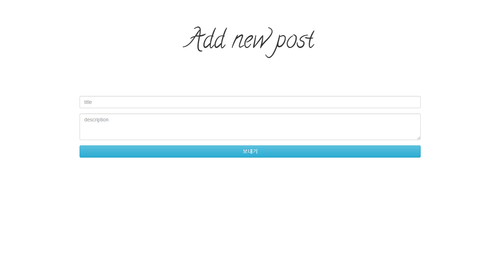

Blog
========

>Node.js/MongoDB를 이용한 CRUD 블로그

Motivation
===
> 웹에 입문할 때 **CRUD** 개념만큼 연습하기 좋은 개념은 없는 것 같다. <br/>
**node.js** 를 이용해서 기존의 한국형 게시판을 만들면서 티스토리나 네이버 블로그 같은 블로그를 만들 수 있겠다고 생각했다. <br/>
데이터베이스 모델의 블로그 글 서술 부분에 자바스크립트 **slice()** 함수를 이용해서 쉽게 블로그 처럼 만들 수 있었고, 인증 부분은 passport.js 같은 모듈 보다는 새로운 인증 방식을 구현해 보고 싶어서 jwt를 이용한 토큰 인증 방식을 선택했다. 
 
Demo
===


> post list


> read, delete, update



> Create page


> 로그인 페이지


> 회원가입 페이지


> jwt 토큰과 로그인 id 확인


Main Technology Stack
===
* Node.js
* mongoose
* jwt
* ejs
* RESTfulAPI
* express
* bootstrap

Feature
===
* 토큰 기반 인증
* 글 작성
* 글 삭제
* 글 수정
* 글 읽기

---
Source Code
===
> [https://github.com/tjdgns8047/Board-Portfolio](https://github.com/tjdgns8047/Board-Portfolio)


Depolyment
===
Installation
---
1. Dowload
```
$ git clone https://github.com/tjdgns8047/Board-Portfolio.git
```
2. Change folder
```
$ cd Board-Portfolio
```
2. Set up
```
$ yarn
```
2. Excute mongoDB demon
```
$ mongod
```
3. execute
```
$ node app.js
```


